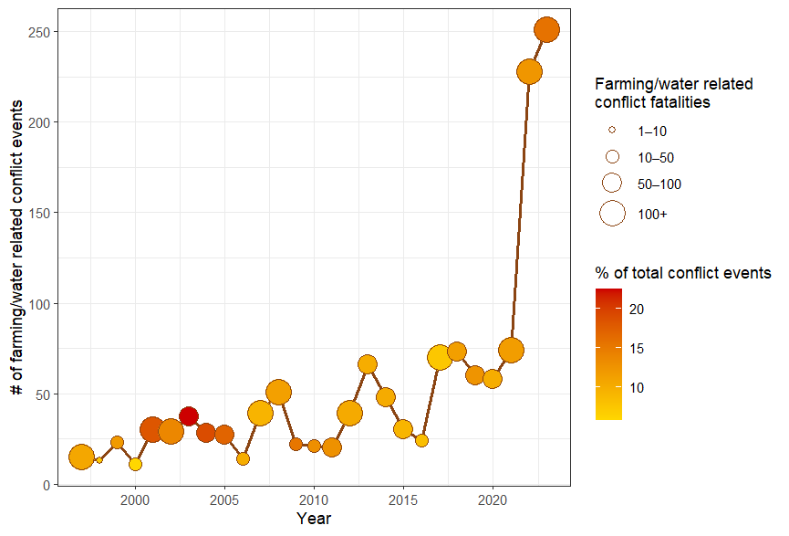
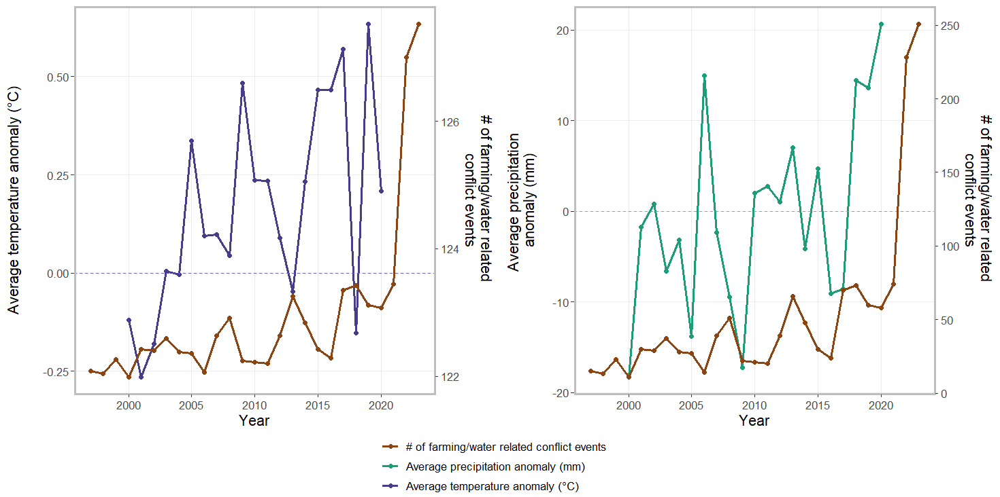

## Table of contents
{: .no_toc .text-delta }
1. TOC
{:toc}

## Analysis Question 

Are farming/herding related conflicts a reflection climate conditions,  a function of overall unrest? Or both?
The steps and outcomes of this analysis are summarized below. 

## Data Preparation 

  * Spatial match
    - Climate data: Filtered the climate data to match the spatial extent for the whole country of Kenya. Note that I did not use the land cover or the rainfed area data for the analysis below, but I conducted the filtering for those datasets

    - Conflict data: Filtered the conflict data to those that were in Kenya

  * Conflict data filtering:
    - I attempted to filter the conflict data that was related to farming, herding, or water. To do this I filtered out any conflict data event (row) that contained the following words or derivatives of these words: farm, herd, cattle, crop, livestock, flock, harvest, graz, pasture, plantation, stock, agricult, cultivat, plants, animal, ranch, water

  
   
  <em>Figure displaying total number of farming related conflicts through time, with colors depicting the % total conflict events that are farming related, the size of the points reflect fatalities attributed to farming conflicts for each year. 
</em>

  * Temporal match: 
    - Climate data: I summarized the temperature and precipitation anomalies data to be the average for each year across space
    - Conflict data: I created two statistics 1) a statistic of the total number conflict each year, and 2) statistic of the total number of farming related conflicts each year
    

  
   
  <em>Figure displaying the farming related conflicts against the two climate data sets through time
</em>

## Model Building 