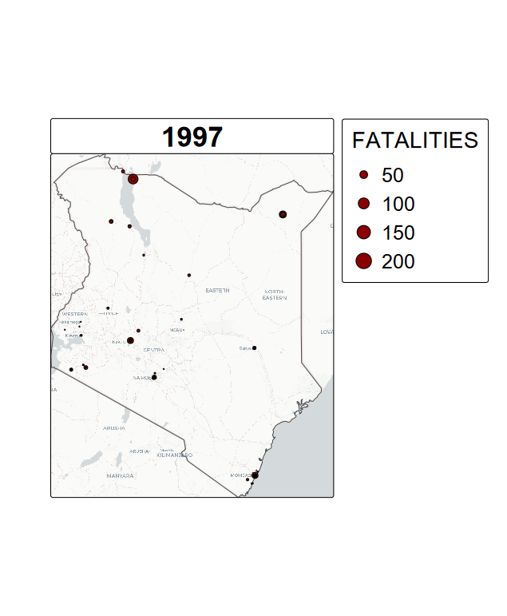
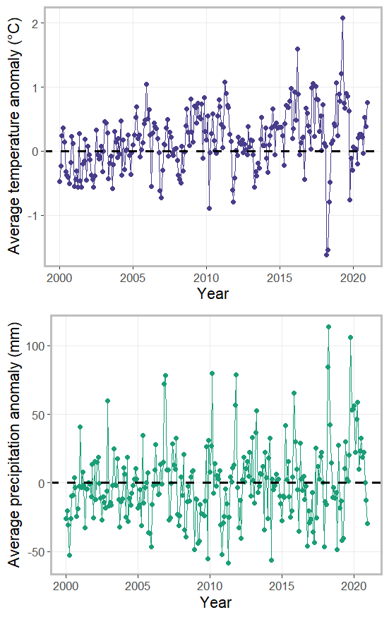

# An analysis website for Analyzing conflict risks in Kenya

### Developed by: Brielle Thompson

**Exercise timing:** 3 hours spent on data analysis and model building, 1 hour spent on creating the website, 30 minutes spent on generating the report

#### The issue: 

Nearly 80% of the world’s agricultural land and nearly all of the world’s grazing land relies on rainfall as its sole source of water, so drought impacts crop and cattle production, affecting both income and nutrition. As herders alter their migration patterns in response to drought, they may come into conflict with farmers. The US Intelligence Community is concerned about humanitarian disasters as well as unrest that stem from drought conditions. 

  
   
  <em> Total annual conflict and fatalities in Kenya
</em>

#### Analysis needed: 
Analyze the risks of conflict between farmers and herders due to water-related drivers in Kenya

1. First, I will analyze the risk of farming/water related conflicts at a large spatial scope (See **Kenya-wide Analysis** Tab)

2. Second, I will analyze the risk of farming/water related conflicts at a small spatial scope, focusing on a “bread basket” county (See **Trans Nzoia Analysis** Tab)

3. Third, I note any recommendations and considerations (See **Takeaways** Tab)

4. Fourth, I display a final graphic summary of the data (See **Final Graphical Representation** tab

#### Climate variables primarily driving the analysis:

  
   
  <em> Figure displaying average temperature and precipitation anomalies through time, averaged across space in Kenya
</em>

